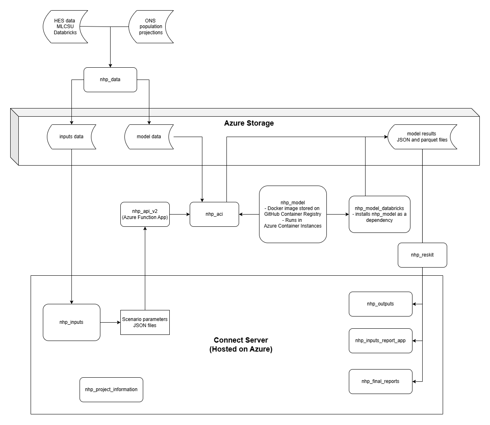

Given the size of the project, there are numerous GitHub repositories relating to NHP, with this number likely to grow. This page gives an overview of the main repositories forming the backbone of the model. It is not exhaustive - if there are any queries on repositories not listed here, do contact a member of the Strategy Unit Data Science team. Please note that some repositories are currently set to private.

## Diagram showing repository relationships

The diagram below shows the relationship between the different repositories and the data flows and architecture connecting them.

{fig-alt="A diagram showing the connections between the various repositories"}

```{mermaid}
%%| fig-width: 12
%%| fig-height: 10
---
config:
  layout: elk
  theme: neutral
  themeVariables:
    fontSize: 20px
  flowchart:
    nodeSpacing: 40
    rankSpacing: 60
---


flowchart LR

    %% Data Sources
    subgraph Sources["Data Sources"]
        direction LR
        hes["HES Data"]
        ons["ONS Population Projections"]
        nhp["nhp_data"]
    end

    hes --> nhp
    ons --> nhp

    %% Storage Layer
    subgraph Storage["Azure Storage"]
        direction LR
        inputs["inputs data"]
        modeldata["model data"]
        results["model results"]
    end

    nhp --> inputs
    nhp --> modeldata

    %% Processing Layer
    subgraph Compute["Azure Compute"]
        direction LR
        api["nhp_api_v2"]
        aci["nhp_aci"]
        model["nhp_model"]
        databricks["nhp_model_databricks"]
        reskit["nhp_reskit"]

        api --> aci
        aci --> model
        model --> databricks
    end

    modeldata --> aci
    aci --> results

    %% Applications Layer
    subgraph Connect["Connect Server"]
        direction LR
        nhpinputs["nhp_inputs"]
        scenario["Scenario Parameters"]
        outputs["nhp_outputs"]
        reports["nhp_inputs_report_app"]
        final["nhp_final_reports"]
        project["nhp_project_information"]
    end

    inputs --> nhpinputs
    nhpinputs --> scenario
    scenario --> api

    results --> reskit

    reskit --> outputs
    reskit --> reports
    reskit --> final
```


## Repositories relating to model inputs

-   [nhp_demogr_module_inputs](https://github.com/The-Strategy-Unit/nhp_demogr_module_inputs) [OPEN]

This repository contains the code that specifies changes in the size, age/sex structure and health status of a hospital's catchment population. The code is written in R and makes use of data sources from the Office for National Statistics.

-   [nhp_data](https://github.com/The-Strategy-Unit/nhp_data) [OPEN]

This code contains all the data processing pipelines for the model, including the types of potentially mitigatable activity (TPMAs). It is written in Pyspark and runs on Databricks.

-   [nhp_inputs](https://github.com/The-Strategy-Unit/nhp_inputs) [OPEN]

This repository provides an interface for users to provide the parameters to feed into the model, the [NHP inputs app](https://connect.strategyunitwm.nhs.uk/nhp/inputs/). It provides a variety of user-friendly functions such as saving inputs from previous runs and providing a document which summarises the parameters used in each run. This repository is written in R and implements a [Shiny](https://shiny.posit.co/) dashboard using [golem](https://thinkr-open.github.io/golem/).

## Repositories relating to the model run

-   [nhp_model](https://github.com/The-Strategy-Unit/nhp_model/) [OPEN]

This repository contains the code that implements the methodologies to model future activity for hospitals. It takes all the input data, including the parameters set by users, and uses the Monte Carlo simulation method to produce estimates of future activity. This repository is written in Python.

-   [nhp_api](https://github.com/The-Strategy-Unit/nhp_api/) [OPEN]

This repository contains the Azure Functions for the API that triggers the running of the model on Azure Container Instances. 

## Repositories relating to model outputs

-   [nhp_outputs](https://github.com/The-Strategy-Unit/nhp_outputs) [OPEN]

This repository provides an interface for users to explore the results of the model, the [NHP outputs app](https://connect.strategyunitwm.nhs.uk/nhp/outputs/). It provides a variety of data visualisations and summaries, and includes the functionality to download model results. This repository is written in R and implements a [Shiny](https://shiny.posit.co/) dashboard using [golem](https://thinkr-open.github.io/golem/).

-   [nhp_inputs_report_app](https://github.com/The-Strategy-Unit/nhp_inputs_report_app) [OPEN]

This repository is a Shiny dashboard allowing the comparison of TPMAs set by schemes using the NHP model.

-   [nhp_output_reports](https://github.com/The-Strategy-Unit/nhp_output_reports) [OPEN]

This repository contains R code to auto-populate the 'final' (sometimes referred to as 'outputs') and 'validation' report templates. Generates scheme-specific (and possibly site-specific) charts, tables and values from model-run data and inserts these into the report template (docx).

-   [nhp_products](https://github.com/The-Strategy-Unit/nhp_products) [OPEN]

This repository contains Python code for producing various products relating to the NHP model. It also includes quality assurance (QA) scripts.

## Repositories relating to documentation

-   [nhp_project_information](https://github.com/The-Strategy-Unit/nhp_project_information) [OPEN]

This is the repository hosting the content you are reading now. The aim is to provide a high level overview of the project as a whole.

## Open source policy

The [policy of the Strategy Unit (MLCSU)](https://connect.strategyunitwm.nhs.uk/open-source-policy/) and [national policy](https://www.gov.uk/government/publications/data-saves-lives-reshaping-health-and-social-care-with-data/data-saves-lives-reshaping-health-and-social-care-with-data#working-with-partners-to-develop-innovations-that-improve-health-and-care) both encourage sharing of code.
We will make:

> ...new source code that we produce or commission open and reusable by default (with clear exceptions)

Source: [Data Saves Lives](https://www.gov.uk/government/publications/data-saves-lives-reshaping-health-and-social-care-with-data/data-saves-lives-reshaping-health-and-social-care-with-data#working-with-partners-to-develop-innovations-that-improve-health-and-care)

